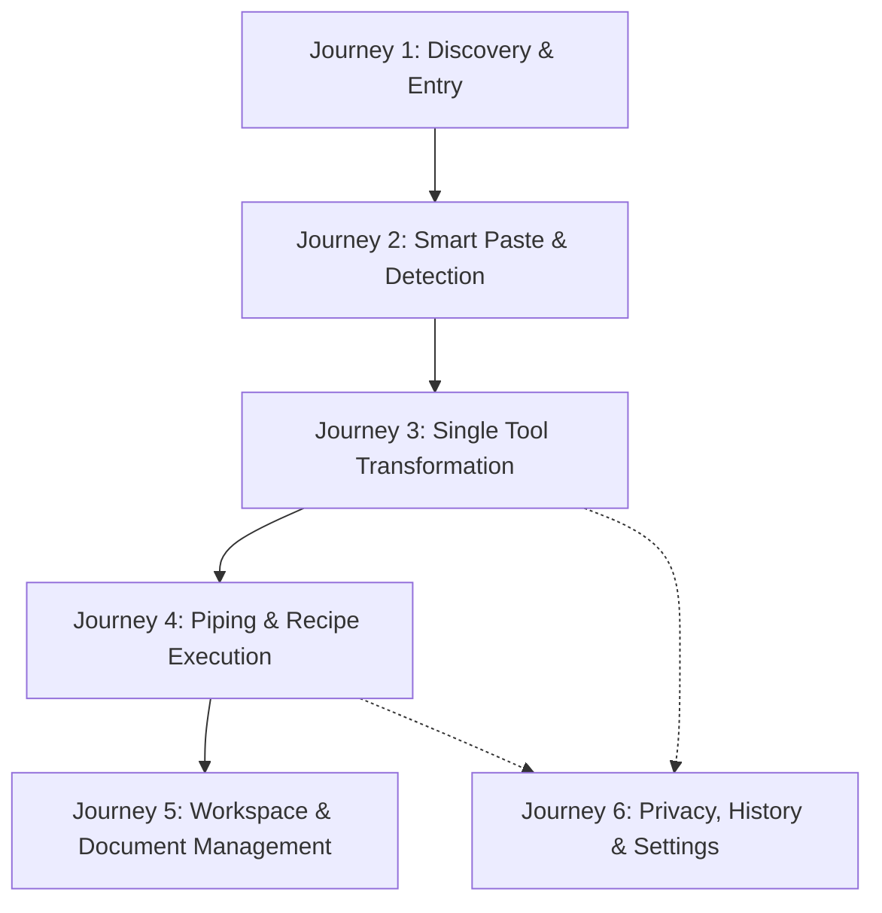
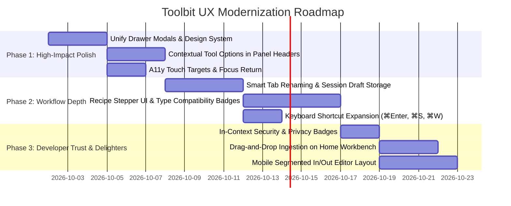

# Toolbit: Comprehensive UX & User Journey Audit Report

**Audit Date:** 1 October 2026
**Auditors:** Senior Product Engineer & Senior UX Designer
**Scope:** Architecture, Information Hierarchy, Interaction Models, Accessibility (WCAG 2.1 AA), Performance, and User Journeys
**Codebase Baseline:** Commit `f2d4072` + Working Tree Implementations (`src/v2`, `src/components`, `src/lib`, `src/ds`)

---

## 1. Executive Summary & Product Thesis

Toolbit sits at a critical product inflection point. It is transitioning from a **traditional 42-tool utility directory** (resembling CyberChef, DevToys, or IT-Tools) into a **modern, local-first developer transformation workspace**.

```
[ Traditional Tool Directory ]  ──►  [ Local-First Data IDE ]
• 42 isolated single-shot pages       • Multi-document tabs
• Disposable copy-paste               • Chained pipeline / recipes
• High bounce rate                    • State preservation & workspaces
• Generic search discovery            • Context-aware smart routing
```

### The Core UX Tension
The application currently exhibits an **identity split**:
1. **The Modern V2 IDE Shell:** Tabbed document model, pipeline chaining, smart paste detection, dark/light design system tokens, split editor panels, and dedicated inspector.
2. **The Legacy Tool Footprint:** 35+ tools still rely on component-local state (`useState`), bypass the document model, use mixed design system components, and handle clipboard/history/piping inconsistently.
3. **Modal/Drawer vs. Workspace Conflict:** The newly added `RecipePanel` and `PreferencesPanel` render as raw slide-in sidebars containing unstyled browser controls (native `<select>`, `<button>↑</button>`, raw `<textarea>` with JSON string editing), which breaks the visual sophistication of the primary IDE shell.

### Primary Verdict
The **product thesis is compelling and defensible**: developers constantly juggle JSON, JWTs, Base64 strings, regex, and timestamps, and they care deeply about data privacy. If Toolbit polishes its **Smart Paste → Transform → Pipe → Save Recipe** loop into a seamless, keyboard-driven experience, it will outperform both disposable online tools and heavy desktop utilities.

---

## 2. User Personas & Core Workflows

| Persona | Primary Goal | Mental Model | Critical Need | Key UX Failure Mode |
|---|---|---|---|---|
| **Backend / API Engineer** (Alex) | Debug malformed payloads, verify JWT claims, inspect API responses | "I have an encoded blob, tell me what's inside and format it cleanly." | Instant routing, zero data loss, guaranteed offline/local privacy | Pasting sensitive JWT or token and worrying it gets sent to a server or saved permanently in browser storage. |
| **Frontend / Fullstack Dev** (Priya) | Convert data formats (CSV → JSON, YAML ↔ JSON), clean mock data | "I need to take this messy fixture, strip whitespace, format it, and pipe it." | Multi-step chaining, keyboard speed, reproducible recipes | Output piping losing options or having to manually switch tabs and copy-paste intermediate outputs. |
| **DevOps / SRE** (Marcus) | Validate cron expressions, generate UUIDs/hashes, inspect Docker commands | "Quick lookup / sanity check while debugging terminal commands." | Speed of entry (⌘K / ⌘V), high-contrast readability, precise validation cues | Complex layout clutter when doing a single 5-second task. |

---

## 3. End-to-End User Journey Analysis



---

### Journey 1: Arrival & First-Time Onboarding

#### The Path
1. User lands on `/` (or direct SEO deep-link `/json-formatter`).
2. If landing on `/`, they see the `HomeDashboard`:
   - Hero header: *"Format, validate, pipe, and keep context without leaving the editor."*
   - Workbench Smart Paste input with 4 example chips (`JSON`, `JWT`, `Cron`, `URL`).
   - 2-column grid: Recent history + Category library.
   - Tool grid: 8 quick-start cards.

#### UX Strengths
- **Immediate Affordance:** The Smart Paste textarea on the homepage gives a clear invitation to act immediately.
- **Example Chips:** Clicking `JSON`, `JWT`, etc., provides immediate feedback on how detection operates.

#### Friction Points & Drop-Off Risks
1. **Empty Inspector State on First Entry:** When opening a tool without custom inspector options, users are presented with a redundant "Tool Profile" and "Local Processing" card that offers minimal utility.
2. **Direct Route Disconnection:** A user landing from Google on `/json-formatter` bypasses the Home Workbench completely. They enter an editor with no onboarding, no hint that Smart Paste or Pipelines exist, and no explanation of tabs.
3. **Terminology Ambiguity:** On the homepage hero, actions say "New JSON" and "Open command palette". There is no introduction to what a "Recipe" or "Workspace" is.

---

### Journey 2: Data Ingestion & Smart Paste (⌘V)

```
[ Global Clipboard / Paste Event ]
               │
               ▼
   [ detectSmartPaste(text) ]
   ├── JSON string? ──────────► Route to /json-formatter (prefill)
   ├── JWT token? ────────────► Route to /jwt-decoder (prefill)
   ├── Base64 string? ────────► Route to /base64-encoder (prefill)
   ├── Cron expression? ──────► Route to /cron-parser (prefill)
   └── Ambiguous / Unknown? ──► Remains on Home or shows detected chips
```

#### UX Strengths
- **Zero-Friction Ingestion:** Global `paste` listener on `window` (when outside editable inputs) captures `⌘V`, runs `detectSmartPaste()`, stores the content in `sessionStorage` via `stashSmartPaste()`, and auto-navigates.
- **Pre-fill Bridge:** `useSmartPasteInput()` smoothly transfers the stashed payload into the destination tool's input field.

#### Friction Points & Drop-Off Risks
1. **The "Disappearing Text" Panic:** When a user hits `⌘V` while focused on a non-input area, the page immediately navigates. If the detection algorithm misidentifies a Base64 string as plain text or JSON, the user is whisked away to an unexpected tool with no undo or explanation of why that tool was selected.
2. **Ambiguous Detection Handling:** In `HomeDashboard`, if a string could be both Base64 and text or JSON and YAML, the chips appear under the input, but the primary button might only suggest one.
3. **Accidental Paste Overwrite:** If a user already has work in `/json-formatter` and pastes globally while in that tool, it re-routes or re-populates, potentially overwriting in-flight inputs if not properly protected by the document model.

---

### Journey 3: Single-Tool Transformation & Editing

#### The Path
1. User enters `/json-formatter`.
2. Input editor on the left (CodeMirror 6), Output editor on the right.
3. Header shows validation badge (`✓ valid object` or `✕ parse error`).
4. Options in the Right Inspector: Indent size (2, 4, 8), Sort keys, Validate while typing.
5. Bottom Status Bar shows: `Processing is local`, `Valid JSON`, `1.4 KB`, `UTF-8`, `Ln 1, Col 1`.

#### UX Strengths
- **Live Two-Way Layout:** Clean split view (`EditorSplit`) with clear visual distinction between editable source and read-only generated output.
- **Non-Destructive Error State:** When an invalid JSON syntax error occurs, the previous valid output is retained in a subdued secondary view, preventing accidental loss of previously formatted results.
- **True Canonical Separation:** Display folding/formatting never silently mutates or truncates arrays in copied/piped payloads.

#### Friction Points & Drop-Off Risks
1. **Inspector Discovery Gap:** Tool options (e.g., indentation, key sorting) are tucked away inside the right-hand `Inspector` panel. On viewports below 1100px, `.tb-inspector { display: none; }` completely hides the inspector without providing an alternate in-panel toolbar! Users on 13-inch MacBooks or tablets lose access to tool configuration.
2. **Dual Status Indicators:** Validation is indicated in three separate places:
   - Panel Header badge (`ValidityBadge`)
   - Bottom Statusbar (`Valid JSON` dot)
   - CodeEditor inline linter gutter
   This creates visual redundancy while failing to provide actionable error navigation (e.g., clicking the error doesn't jump the cursor to the offending line/column in CodeMirror).
3. **Copy Action State Fragility:** The copy button uses a 1500ms timeout for the `Copied` checkmark. If clipboard permission is rejected by browser policy, the tooltip shows `"Copy denied — select the output and copy manually"`, but there is no persistent visual alert or fallback select-all focus.

---

### Journey 4: Output Piping & Executable Recipes

```
[ Step 1: Input JSON ] ──► [ Format & Sort ] ──► [ Output ]
                                                    │
                                                    ▼ (Pipe To...)
[ Step 2: Base64 Input ] ◄──────────────────────────┘
      │
      ▼
[ Step 2: Base64 Output ] ──► [ Save Pipeline as Workspace / Recipe ]
```

#### UX Strengths
- **The Pipeline Strip (`PipelineStrip`):** Located directly beneath the editor split, it shows the active transformation breadcrumb (e.g., `JSON Formatter` → `Base64 Encoder`) with an immediate dropdown: `Pipe output to…`.
- **Contract Compatibility:** `src/lib/tool-contract.ts` and `src/config/tool-chains.config.ts` calculate valid target tools based on data types (`text`, `json`, `base64`, `csv`), preventing nonsensical chains (e.g., piping raw CSV directly into a Certificate Decoder).

#### Friction Points & Critical UX Breaks
1. **Cognitive Confusion: "Save Pipeline" vs. "Save Workspace" vs. "Recipes":**
   - In `PipelineStrip.tsx`, the save button says: *"Save pipeline as workspace"*.
   - In `Topbar.tsx`, the button says: *"Save open tools"* or *"Recipes"*.
   - Clicking save in `PipelineStrip` fires `open-workspaces` which opens `PhaseTwoPanels` with a workspace list.
   - But clicking `Recipes` in the Topbar opens `RecipePanel.tsx`, which is a completely separate dialog with an entirely different data model (`Recipe` vs `Workspace`)!
   - **User Impact:** High mental dissonance. The user cannot tell whether they are saving an open set of tabs, a saved workspace, or an automated recipe.
2. **Recipe Panel UI Downgrade:**
   Opening `RecipePanel` presents a noticeable aesthetic drop:
   - Native browser `<select>` dropdowns and unstyled `<textarea>` elements.
   - Raw JSON editing required to change step options (`<textarea defaultValue={JSON.stringify(step.options)} />` with error `"Settings must be JSON"` on blur).
   - Step reordering via crude `↑` and `↓` text buttons.
   - Execution output rendered inside native `<details><summary>` and unformatted `<pre>`.
   - **User Impact:** Breaks the impression of a polished, professional tool.

---

### Journey 5: Multi-Tab Document Management & Persistence

```
[ Tab 1: JSON Formatter 1 ]  [ Tab 2: JSON Formatter 2 ]  [ Tab 3: JWT Decoder ]  [ + ]
```

#### UX Strengths
- **Document-Level State Isolation:** Thanks to `useDocumentField` and `workspace-store`, each tab is an independent `ToolDocumentV1` with its own `id`, `toolId`, `options`, and `payload`. Opening two JSON tabs allows working on two different payloads simultaneously without collision.
- **Accidental Close Recovery:** `⌘⇧T` reopens the last closed document tab via `useWorkspace.getState().reopen()`.

#### Friction Points & Drop-Off Risks
1. **Uninformative Tab Titles:**
   In `TabStrip.tsx`, tabs are rendered as: `JSON Formatter 1`, `JSON Formatter 2`, `Base64 Encoder 3`.
   - There is no document renaming or payload preview in the tab title.
   - If a user has 3 JSON tabs open (e.g., "Request Payload", "Response Payload", "Config"), they cannot distinguish them without clicking through each one.
2. **Dirty / Unsaved Indicators:**
   Tabs show a simple `•` dot if `tab.payload` exists, but there is no distinction between "In-Memory Draft", "Saved in Local Workspace", or "Persisted to Disk".
3. **Browser Refresh / Restore Surprise:**
   By default, `workspace-store` partialize strips `payload` from persistence to prevent unencrypted sensitive data retention (`tabs.map(({payload: _payload, ...doc}) => doc)`).
   - **The Friction:** If a user pastes a 500-line JSON document into Tab 1, works on it, and refreshes the browser, the tab remains, but the payload vanishes! Unless they explicitly saved it to a Workspace with `"Include data"` checked, their work is wiped on reload.
   - **UX Rule Violation:** *Principle of Least Surprise*. Users expect browser tabs to survive a simple page reload.

---

### Journey 6: Privacy, History & Settings

#### UX Strengths
- **Tool Sensitivity Policy (`src/lib/tool-policy.ts`):** Sensitive tools (`password-generator`, `totp-generator`, `jwt-decoder`, `certificate-decoder`, `api-request-builder`, `websocket-tester`, etc.) are classified as `'secret'` with `historyDefault: 'disabled'`.
- **Sanitized Telemetry:** PostHog adapter (`src/lib/telemetry`) strips URLs, query strings, hashes, and payloads; events use an explicit schema allowlist.
- **Clear Copy:** Statusbar accurately states *"Processing is local"*, and settings clearly describe data boundaries.

#### Friction Points & Drop-Off Risks
1. **Preferences Dialog UX Quality:**
   `PreferencesPanel.tsx` uses native checkboxes, unstyled `<select>` elements, and plain `<button>` tags without design system styling.
2. **All-or-Nothing History Model:**
   Users can toggle history globally or adjust retention (1, 7, 30, 90 days), but there is no per-tool history toggle or visual indication in the tool header showing whether history is currently active for that specific document.
3. **No Visual Security Badge on Secret Tools:**
   When using `JWT Decoder` or `Password Generator`, the user has no visual badge in the editor header reassuring them: `🔒 Secret Tool: History & Cloud Sync Permanently Disabled`. They only find this out if they dig into Settings.

---

## 4. UX Heuristic Evaluation (Nielsen's 10 Heuristics)

| Heuristic | Rating (1-5) | Current Implementation Assessment | Critical Findings & Opportunities |
|---|:---:|---|---|
| **1. Visibility of system status** | 3.5 / 5 | Status bar shows validity, byte count, line/col, local processing indicator. | Validation errors don't link to the error line. Large payload worker processing has a subtle "processing…" text with no progress bar or cancellation button in the editor view. |
| **2. Match between system & real world** | 3.0 / 5 | Tools use standard developer terminology (JSON, Base64, JWT, Cron). | High cognitive confusion between "Pipeline", "Recipe", "Workflow", and "Workspace". Step settings in Recipe Panel require typing raw JSON. |
| **3. User control & freedom** | 4.0 / 5 | ⌘⇧T reopens closed tabs; undo delete exists for saved recipes. | Global ⌘V auto-routes without confirmation or "undo route" toast. No document duplicate button in the tab strip. |
| **4. Consistency & standards** | 2.5 / 5 | V2 tools (JSON, Base64, JWT, URL, UUID, Cron) share design tokens. | Inconsistency between V2 tools and 35+ legacy tools. Modals (`PhaseTwoPanels`, `RecipePanel`, `PreferencesPanel`) have varying styles and control primitives. |
| **5. Error prevention** | 4.0 / 5 | Destructive array collapse removed; previous valid output retained on parse failure; recipe step type validation. | Refreshing the browser silently dumps uncommitted payloads due to payload-stripping persistence policy. |
| **6. Recognition rather than recall** | 4.0 / 5 | Smart Paste auto-detects; Command Palette (⌘K) searches 42 tools; Recent History on home. | Tabs are named generically (`JSON Formatter 1`). Once multiple tabs are open, users must click each one to inspect content. |
| **7. Flexibility & efficiency of use** | 4.2 / 5 | Keyboard shortcuts (⌘K, ⌘1-3, ⌘⇧T, ⌘V); density toggle (Compact/Comfortable); quick sample buttons. | Missing essential shortcuts: ⌘Enter (Format/Execute), ⌘S (Save Workspace/Recipe), ⌘W (Close active tab). |
| **8. Aesthetic & minimalist design** | 3.2 / 5 | High quality in `WorkspaceShell`, `HomeDashboard`, and `EditorSplit`. | Right Inspector contains redundant cards; `RecipePanel` and `PreferencesPanel` look unstyled and unpolished. |
| **9. Help users recognize & recover from errors** | 3.8 / 5 | Clear parse error alerts; previous output preserved; friendly fallback copy. | JSON schema/parse errors lack quick-fix suggestions (e.g., "Replace single quotes with double quotes"). |
| **10. Help & documentation** | 3.0 / 5 | Prerendered SEO guides exist; status bar has privacy cues. | In-app documentation is minimal. No tooltip explaining how recipes work or how to chain tools together. |

---

## 5. Visual Hierarchy & Information Architecture Audit

```
┌────────────────────────────────────────────────────────────────────────────────────────┐
│ TOPBAR: Brand Breadcrumb  │  Settings  Recipes  [Density]  [Inspector]  [Theme]  Save  │
├──────────────┬──────────────────────────────────────────────────────────┬──────────────┤
│ SIDEBAR      │ TAB STRIP: [Doc 1] [Doc 2] [+]                           │ INSPECTOR    │
│ • Search ⌘K  ├────────────────────────────┬─────────────────────────────┤ (Collapsible)│
│ • Favorites  │ INPUT PANEL                │ OUTPUT PANEL                │              │
│ • Library    │                            │                             │ • Tool opts  │
│ • History    │ [ CodeMirror 6 Editor ]    │ [ CodeMirror 6 Editor ]     │ • Local card │
│ • Workspaces │                            │                             │              │
│ • Snippets   ├────────────────────────────┴─────────────────────────────┤              │
│              │ PIPELINE STRIP: Tool A ──► Tool B  [ Pipe to... ] [Save] │              │
├──────────────┴──────────────────────────────────────────────────────────┴──────────────┤
│ STATUSBAR: Local Shield │ Valid Badge │ Bytes │ Encoding │ Pipeline count │ Ln/Col     │
└────────────────────────────────────────────────────────────────────────────────────────┘
```

### Critical IA Gaps Identified

#### 1. The Right Inspector Collision
- **Problem:** The right Inspector is 280px wide. On screens between 1100px and 1280px (e.g., standard MacBook Air or split desktop window), the workspace width is restricted:
  `1280px - 220px (Sidebar) - 280px (Inspector) = 780px for dual editors`.
  This leaves only 370px per editor pane, causing severe horizontal scrolling for code.
- **Recommendation:** Move tool-specific options (Indentation, Key Sorting, Mode) directly into the **PanelHeader** of the relevant editor (Input or Output), and reserve the Inspector for metadata, schema documentation, and history. When screen width < 1200px, auto-collapse the Inspector.

#### 2. The Floating Pipeline Strip
- **Problem:** `PipelineStrip` is rendered at the bottom of `EditorSplit`. When long text is entered into the editor, the pipeline strip can get pushed down or feels detached from the transformation action.
- **Recommendation:** Integrate the "Pipe To" action as a primary button in the **Output PanelHeader** (e.g., `[ Copy ] [ Pipe Output ▾ ]`), with the visual pipeline trail displayed as a subtle breadcrumb in the Topbar or Tab title.

#### 3. Modal Dialog Overload
The application currently uses **five different slide-in / modal surfaces**:
1. `CommandPalette` (Centered overlay dialog)
2. `HistoryPanel` (Right-side slide-in drawer)
3. `PhaseTwoPanels` (Workspaces, Snippets, Favorites right-side drawer)
4. `RecipePanel` (Right-side drawer)
5. `PreferencesPanel` (Right-side drawer)

Having 4 separate right-side drawers with duplicate scrim logic (`tb-phase-scrim`) creates maintenance overhead and user disorientation. They should be consolidated into a unified **Workspace Drawer / Library Manager**.

---

## 6. Accessibility (A11y) & Responsiveness Audit

### WCAG 2.1 AA Compliance Checklist

| Area | Status | Observed Finding | Recommendation |
|---|:---:|---|---|
| **Keyboard Focus Traps** | ⚠️ Warning | `useFocusTrap` is implemented in modals, but when closing via `Esc`, focus does not consistently return to the trigger element that opened it. | Store `document.activeElement` on open and call `triggerRef.current?.focus()` on dismiss. |
| **Color Contrast** | ⚠️ Warning | `--text-faint` (labels, breadcrumb dividers, timestamps) tests at `3.2:1` on dark background in `colors.css`, which fails WCAG AA minimum of `4.5:1` for normal text. | Adjust `--text-faint` token from `hsl(215 15% 42%)` to at least `hsl(215 15% 58%)` in dark mode to guarantee minimum `4.5:1` contrast ratio. |
| **Programmatic Names & ARIA** | ⚠️ Warning | Tab buttons in `TabStrip.tsx` have `role="tab"`, but close buttons are nested directly inside the tab container button without an enclosing `role="presentation"` list item. | Restructure tab items: use an outer `<div role="presentation">` containing the `<button role="tab">` and a distinct secondary `<button aria-label="...">` to prevent invalid nested interactive roles. |
| **Live Announcements** | ⚠️ Warning | Error messages during typing can fire rapidly on every keystroke when `validateWhileTyping` is enabled. | Debounce live region announcements by 500ms so screen readers announce parse failures once the user pauses typing, rather than interrupting every keystroke. |
| **Touch Targets on Mobile** | ❌ Fail | `.tb-chip`, `.tb-text-action`, `.tb-phase-row-actions button`, and tab close buttons render with hit targets around `24px × 24px`. | Enforce a minimum hit target size of `44px × 44px` (or `36px × 36px` on dense desktop with `8px` padding buffer) across all interactive elements to satisfy WCAG 2.5.5 and 2.5.8. |
| **Keyboard Navigation in CodeMirror** | ⚠️ Warning | Tabbing into CodeMirror captures the `Tab` key for indentation by default, making it difficult for keyboard-only users to navigate past the input editor to the output panel. | Support standard `Esc` followed by `Tab` to escape editor focus trapping, and document this shortcut in the status bar or an a11y help modal. |

---

### Responsive Viewport Breakdown

```
┌─────────────────────────┬─────────────────────────┬─────────────────────────┐
│ Desktop (≥ 1280px)      │ Tablet (720px – 1100px) │ Mobile (< 720px)        │
├─────────────────────────┼─────────────────────────┼─────────────────────────┤
│ • Full sidebar (220px)  │ • Collapsed sidebar     │ • Bottom nav or drawer  │
│ • Dual-pane split       │ • Stacked editor panes  │ • Single active editor  │
│ • Dedicated Inspector   │ • Inspector auto-hidden │ • Segmented In/Out view │
│ • Full Tab Strip        │ • Tab strip scrolls     │ • Drawer modals 100% vw │
└─────────────────────────┴─────────────────────────┴─────────────────────────┘
```

1. **Desktop (≥ 1280px):**
   - The intended sweet spot. Both editors sit side-by-side with full CodeMirror line numbers and active syntax highlighting.
   - **Flaw:** High-density displays (e.g. 1440p / 4K) leave excessive empty gutters on the homepage (`width: min(100%, 1180px)`), making the dashboard feel isolated.
2. **Tablet & Laptop (720px – 1100px):**
   - `.tb-inspector { display: none; }` kicks in abruptly at `1100px`, removing tool options without rendering an inline fallback.
   - Dual editor split forces horizontal cramping between 768px and 900px before collapsing into a single column.
3. **Mobile (< 720px):**
   - The sidebar collapses to `56px` with icons only. Topbar and tab strip become cluttered with action buttons.
   - Editors stack vertically: `Input` on top, `Output` below. On mobile virtual keyboards, focusing the input completely obscures the output.
   - **Recommendation:** Implement a mobile segmented control: `[ Input (●) ] [ Output ]` allowing the user to flip between panes while preserving screen real estate.

---

## 7. Deep-Dive UX & Engineering Recommendations

---

### Recommendation 1: Consolidate the "Workspace", "Recipe", and "Pipeline" Concept

#### The Problem
Currently, the user encounters four overlapping terms with distinct implementations:
- **Pipeline:** A sequential chain of tools (`useToolPipe`) represented in the bottom `PipelineStrip`.
- **Workflow:** Preset tool bundles in `PRESET_WORKFLOWS` (e.g., API Debug, Data Cleanup).
- **Workspace:** A saved set of open tabs and options (`WorkspaceV1` in `PhaseTwoPanels`).
- **Recipe:** An ordered, executable pipeline with step settings (`RecipeV1` in `RecipePanel`).

#### The Solution: The "Document vs. Recipe" Model
Adopt the bounded terminology from ADR-004:
1. **Document:** An active working instance of a tool (e.g., `JSON Formatter (Tab 1)`).
2. **Workspace:** The spatial layout and collection of open documents, preserving your current working session.
3. **Recipe:** An ordered, reusable transformation chain (Step 1 → Step 2 → Step 3) that accepts an input and executes automatically without requiring manual tab-hopping.

```mermaid
flowchart LR
    subgraph Working Session ["Workspace (Current Session)"]
        D1["Doc 1: JSON Formatter"]
        D2["Doc 2: JWT Decoder"]
        D3["Doc 3: Base64 Encoder"]
    end

    subgraph Transformation Engine ["Recipe (Executable Automation)"]
        S1["Step 1: Base64 Decode"] --> S2["Step 2: JSON Format"] --> S3["Step 3: Base64 Encode"]
    end

    Working Session -- "Export / Extract Pipeline" --> Transformation Engine
    Transformation Engine -- "Open in Workspace" --> Working Session
```

#### Engineering Action
- Replace "Save pipeline as workspace" in `PipelineStrip` with **"Save as Recipe"**.
- Merge the UI of `PhaseTwoPanels` (Workspaces, Snippets) and `RecipePanel` into a single, cohesive **"Library Drawer"** with 3 clean tabs:
  1. `Workspaces` (Your saved environments)
  2. `Recipes` (Your automated transformation chains)
  3. `Snippets` (Your saved scratchpad templates)

---

### Recommendation 2: Move Essential Tool Options to Panel Headers

#### The Problem
When the right Inspector is closed (or hidden on screens < 1100px), tools lose their configuration controls. Toggling indentation or Base64 encode/decode requires glancing 800px away from the actual input editor.

```
CURRENT (Disconnected):
┌───────────────────────────┬───────────────────────────┬───────────────────────┐
│ Input                     │ Output                    │ Inspector             │
│ [ CodeMirror Input ]      │ [ CodeMirror Output ]     │ [x] Sort Keys         │
│                           │                           │ Indent: [ 2 spaces ▾] │
└───────────────────────────┴───────────────────────────┴───────────────────────┘

PROPOSED (Contextual & Responsive):
┌───────────────────────────────────────────┬───────────────────────────────────────────┐
│ Input  [ Sample ] [ Clear ]               │ Output  [ Indent: 2 ▾ ] [ Sort ] [ Copy ] │
│ ───────────────────────────────────────── │ ───────────────────────────────────────── │
│ [ CodeMirror Input ]                      │ [ CodeMirror Output ]                     │
└───────────────────────────────────────────┴───────────────────────────────────────────┘
```

#### Engineering Action
- In `PanelHeader` of each tool, embed quick controls:
  - **JSON Formatter:** Indent selector (`2 / 4 / Tabs`), `Sort Keys` toggle.
  - **Base64 Encoder:** Mode switch (`Encode` / `Decode`), `URL Safe` toggle.
  - **JWT Decoder:** Signature verification toggle, raw/formatted toggle.
- Reserve the right Inspector for rich metadata that doesn't need constant interaction:
  - JSON Schema validation errors list
  - Token headers & claims table
  - Tool documentation and offline security proof

---

### Recommendation 3: Professionalize the Recipe Experience

#### The Problem
`RecipePanel.tsx` currently uses raw `<select>`, `<button>↑</button>`, and unformatted JSON textareas. It feels like an internal test harness rather than a flagship feature.

```
PROPOSED RECIPE STEPPER UI:
┌────────────────────────────────────────────────────────────────────────┐
│ RECIPE: API Payload Cleanup & Validation                               │
├────────────────────────────────────────────────────────────────────────┤
│ [1] Base64 Decoder                                       [ ⚙ ] [ ✕ ]   │
│     Mode: Decode (URL Safe) · ✓ Compatible with step 2                 │
├────────────────────────────────────────────────────────────────────────┤
│   ↓ (Data: UTF-8 Text)                                                 │
├────────────────────────────────────────────────────────────────────────┤
│ [2] JSON Formatter & Validator                           [ ⚙ ] [ ✕ ]   │
│     Indent: 2 spaces · Sort Keys: ON · ✓ Compatible with step 3        │
├────────────────────────────────────────────────────────────────────────┤
│   ↓ (Data: Formatted JSON)                                             │
├────────────────────────────────────────────────────────────────────────┤
│ [3] Hash Generator (SHA-256)                             [ ⚙ ] [ ✕ ]   │
│     Algorithm: SHA-256                                                 │
├────────────────────────────────────────────────────────────────────────┤
│ [ + Add Step ]                                                         │
│                                                                        │
│ INPUT:                                                                 │
│ [ CodeMirror Small / Multi-line Area ]                                 │
│                                                                        │
│ [ ▶ Run Recipe (⌘Enter) ]  [ ⏹ Stop ]  [ 💾 Save ]  [ ⤓ Export ]        │
└────────────────────────────────────────────────────────────────────────┘
```

#### Engineering Action
- Replace the raw `<textarea>` in `src/v2/RecipePanel.tsx` with dedicated, typed micro-form controls for each supported tool.
- Render compatibility badges between steps (`compatible(outputType(step[i]), inputType(step[i+1]))`) with an inline warning if a step produces incompatible output.
- Add step run-time diagnostics (e.g. `Step 1: 0.4ms`, `Step 2: 1.2ms`, `Output: 1.4 KB`).

---

### Recommendation 4: Meaningful Tab Management & In-Session Draft Preservation

#### The Problem
1. **Generic Tab Names:** `JSON Formatter 1`, `JSON Formatter 2`. A developer working on two API responses cannot tell which tab is which.
2. **Refresh Data Loss:** `workspace-store` currently strips `payload` on tab persistence to adhere strictly to the privacy policy. A simple browser refresh or accidental tab closure can erase in-progress scratchpad work.

#### The Solution
1. **Smart Tab Titles & Inline Renaming:**
   - Derive automatic tab subtitles from payload heuristics:
     - JSON: Root key preview (e.g. `JSON: { user, auth... }`) or top-level array count (`JSON: [142 items]`).
     - JWT: Subject or Issuer claim (`JWT: sub=auth0|123`).
     - Regex: Pattern preview (`Regex: /^[a-z0-9]+/`).
   - Allow double-clicking any tab title to rename it to a custom label (e.g. `Staging Token`, `Prod Config`).
2. **Session-Level Draft Storage (`sessionStorage`):**
   - Retain payload state in `sessionStorage` (scoped exclusively to the active tab lifecycle and automatically cleared on browser exit) rather than unencrypted permanent `localStorage`.
   - Provide an explicit "Save to Workspace" affordance for long-term retention.
   - Show a subtle `Draft` badge in the tab header indicating uncommitted session data.

---

### Recommendation 5: Visualizing Privacy & Security Cues In-Context

#### The Problem
Toolbit correctly implements strict privacy policies in code (sensitive tools are marked `'secret'` in `tool-policy.ts` and excluded from history by default). However, the UI does not clearly communicate this protection to the user in their active workflow.

```
CURRENT:
Status bar: "Processing is local" (Static text, same for all tools)

PROPOSED (Context-Aware Badges in Editor Header):
For Non-Sensitive Tools (JSON, Base64, Strip Whitespace):
  [ 🔒 Local Sandbox · History Active ]

For Sensitive Tools (JWT Decoder, Password, TOTP, API Builder):
  [ 🛡️ Secret Tool · Zero Persistence · History & Cloud Disabled ]
```

#### Engineering Action
- In `PanelHeader` of every tool, render a `SecurityBadge` derived from `getToolPolicy(toolId)`:
  - If `sensitivity === 'secret'`: display a shield icon with tooltip: *"Sensitive data: payload will never be persisted to history, telemetry, or exported URLs."*
  - If `network === 'user_initiated'`: display a network indicator: *"Network requests are user-initiated only directly from your browser."*
- In `src/v2/HistoryPanel.tsx`, display an informational callout explaining why certain tools (e.g. passwords, certificates) do not appear in recent history.

---

### Recommendation 6: Enhancing the Smart Paste & Global Ingestion Loop

#### The Problem
While global `⌘V` routing works smoothly, it suffers from two UX gaps:
1. **No Routing Feedback:** Navigating instantly on paste can startle users who were not expecting a page change.
2. **Ambiguity Resolution:** When a payload matches multiple tools (e.g. valid Base64 string that also parses as valid JSON), the system automatically selects one without showing the alternative.

#### The Redesign
1. **Pasted Handoff Toast:**
   When global `⌘V` triggers navigation from the home screen or another tool, display a compact, non-intrusive toast:
   > **Detected JSON Formatter** — Routed from clipboard (`1.2 KB`).
   > *[ Undo (⌘Z) ]  [ Switch to JWT Decoder ]*
2. **Smart Paste Drop Zone on Home:**
   Enhance `HomeDashboard.tsx` with drag-and-drop file support. Allow dragging `.json`, `.csv`, `.txt`, `.pem`, or `.log` files directly into the workbench to route and open them in a new tab.

---

### Recommendation 7: High-Power Developer Hotkeys & Command Palette

#### Recommended Shortcut Matrix

| Shortcut | Action | Scope | User Benefit |
|---|---|---|---|
| `⌘Enter` / `Ctrl+Enter` | Run transformation / format / encode | Tool Editor & Recipe Panel | Instant execution without reaching for the mouse. |
| `⌘W` / `Ctrl+W` | Close active document tab | Workspace Shell | Standard browser/IDE tab closure muscle memory. |
| `⌘⇧T` / `Ctrl+Shift+T` | Reopen last closed document tab | Workspace Shell | Recovers accidentally closed work instantly. |
| `⌘S` / `Ctrl+S` | Save current document / workspace / recipe | Workspace Shell | Prevents default browser "Save HTML page" dialog and saves Toolbit state instead. |
| `⌘P` / `Ctrl+P` | Pipe current output to next tool | Output Panel | Rapid chaining of operations. |
| `⌘⌥C` / `Ctrl+Alt+C` | Copy output to clipboard | Output Panel | Copies transformed output immediately from any focus position. |

---

## 8. Prioritized Implementation Roadmap



### Implementation Phases Breakdown

#### Phase 1: Polish & Consistency (Immediate Impact — 1–1.5 Weeks)
*Goal: Eliminate visual downgrades and ensure WCAG AA accessibility compliance.*
- **P1.1 — Redesign `RecipePanel` and `PreferencesPanel`:**
  - Replace raw HTML `<select>`, `<button>`, `<input>`, and JSON `<textarea>` with Design System components (`Button`, `Select`, `Input`, `Checkbox`, `Badge`).
  - Unify the slide-in drawer layout with consistent padding, typography, and focus-trapping return behavior.
- **P1.2 — In-Header Tool Options:**
  - Move essential controls (JSON Indentation, Sort Keys; Base64 Mode, URL Safe) into the `PanelHeader` of each tool so users on screens under `1100px` (or with the Inspector closed) never lose control over transformations.
- **P1.3 — Accessibility & Target Sizing:**
  - Expand touch targets on `.tb-chip`, tab close buttons, and pagination controls to at least `36px × 36px` (desktop) and `44px × 44px` (mobile).
  - Increase dark-mode contrast for `--text-faint` tokens to exceed `4.5:1`.

#### Phase 2: Workflow Depth & Durability (Core Product Differentiation — 2 Weeks)
*Goal: Transform Toolbit into an indispensable daily developer workspace.*
- **P2.1 — Tab Renaming & Session Draft Persistence:**
  - Enable automatic content-aware tab labeling (e.g. `JSON: { users: 4 }` instead of generic `JSON Formatter 2`).
  - Store uncommitted active session drafts in `sessionStorage` so refreshing the browser never wipes active work, while maintaining strict permanent privacy policies.
- **P2.2 — Visual Recipe Stepper:**
  - Upgrade `RecipePanel` into a clean visual stepper showing compatibility badges between steps, real-time step outputs, and execution duration.
  - Clarify the user mental model by renaming ambiguous "Save Pipeline as Workspace" triggers to **"Save as Recipe"**.
- **P2.3 — Power Hotkeys:**
  - Implement `⌘Enter` (Format / Run), `⌘S` (Save Draft / Recipe), `⌘⌥C` (Copy Output), and intercept `⌘W` to close the active document tab.

#### Phase 3: Trust & Platform Delighters (1–2 Weeks)
*Goal: Cement Toolbit's reputation for privacy, responsiveness, and speed.*
- **P3.1 — Contextual Security Indicators:**
  - Add visual `[ 🛡️ Secret Tool · Zero Persistence ]` or `[ 🔒 Local Sandbox ]` badges to tool headers so developers immediately know their data never touches a server or persistent history.
- **P3.2 — Drag-and-Drop & Multi-format Smart Paste:**
  - Add file drag-and-drop onto the `HomeDashboard` workbench (`.json`, `.csv`, `.jwt`, `.xml`).
  - Display non-intrusive routing toast with undo option when smart paste navigates automatically.
- **P3.3 — Responsive Mobile Segmented Layout:**
  - Introduce an `[ Input ] | [ Output ]` segmented toggle on mobile devices so virtual keyboards don't compress editors into unusable viewports.

---

## 9. Conclusion

Toolbit already possesses the hardest technical foundations:
- A high-performance CodeMirror 6 editor engine
- Web Worker offloading for heavy operations
- Strict sanitization on telemetry and data boundaries
- A robust, typed transformation contract

By addressing the UX fragmentation between the **V2 IDE Shell**, **Drawer Modals**, and **Legacy Tools**, and aligning the mental models for **Documents**, **Workspaces**, and **Recipes**, Toolbit will offer the cleanest, fastest, and most trustworthy developer utility experience on the web.
